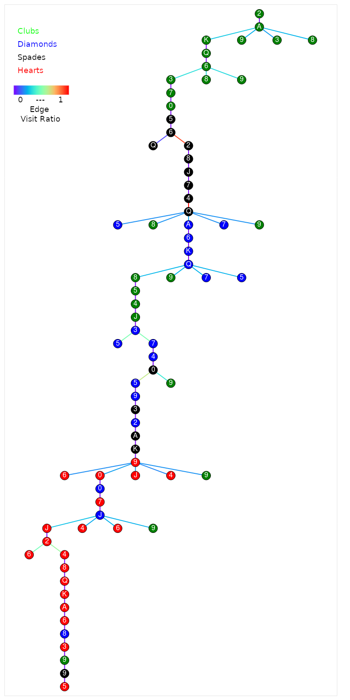
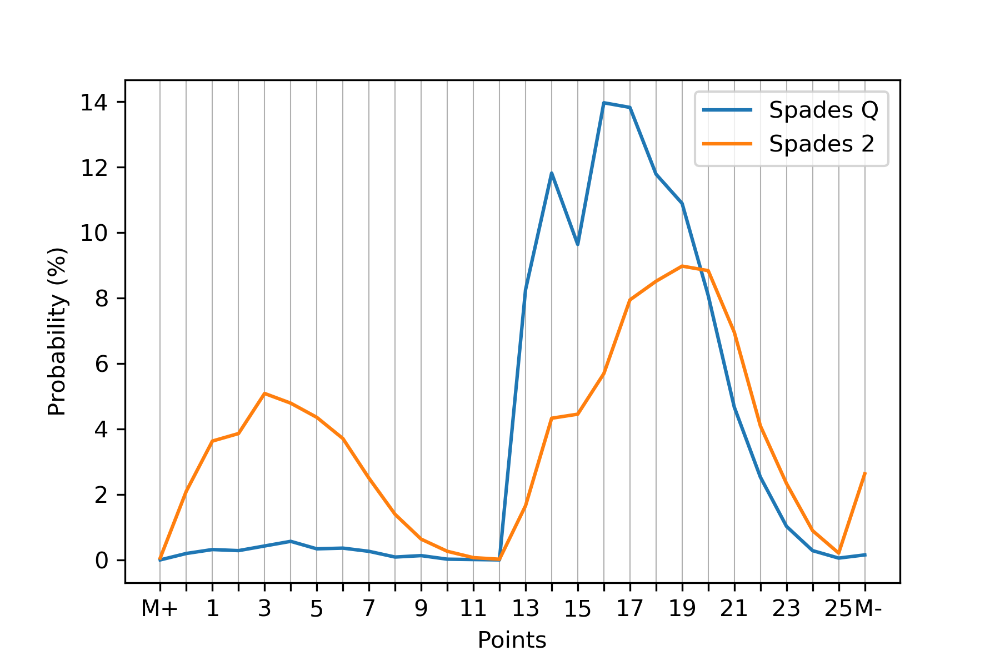

# Monte-Carlo Tree Search (MCTS)

A generic multithreaded Monte-Carlo tree search algorithm with CUDA accelerated random rollout.
Only the standard C++ library is used, no external library is included.
Multithreading is implemented with the help of OpenMP, which is supported by recent compilers (GCC: “-fopenmp”, MSVC: “/openmp”).
CUDA compiling is optional.
Interfacing between problems and mcts is solved with templates.
Similarly, the interface of the underlying tree container for mcts is also based on templates.

Problems that can be solved:

* Chess
* Card game Hearts

Source files contain inline documentation with doxygen syntax:

* src/chess.hpp - Game handling and logic for Chess
* src/hearts.hpp - Game handling and logic for card game Hearts
* src/mcts.hpp - Monte Carlo tree search
* src/mcts.cu(h) - CUDA implementation to execute multiple random rollouts
* src/mctree.hpp - Several underlying tree containers for tree search
* src/flownetwork.hpp - Solve assignment problem with Ford-Fulkerson, for handling unknown cards in game Hearts
* src/main_chess.cpp - Console input/output for game Chess
* src/main_hearts.cpp - Console output for card game Hearts

Python tools:

* tools/dispatcher.py - Execute several instances of Hearts and perform tests
* tools/visualization.ipynb - Jupyter Notebook to visualize gametree (currently for Hearts)

# Links

* [Game rules for Hearts](https://en.wikipedia.org/wiki/Hearts)
* [Browser based Hearts, implemented rules](https://cardgames.io/hearts/)
* [Monte Carlo tree search](https://en.wikipedia.org/wiki/Monte_Carlo_tree_search)
* [Ford-Fulkerson algorithm](https://en.wikipedia.org/wiki/Ford%E2%80%93Fulkerson_algorithm)

# Licensing

This code is purely for educational purpose and it is not intended to be used in any form.
You can do this at your own risk, I am not responsible for your actions.
I would appreciate if you use this code, mentioning the original source and helping me in further developing it.
By using the code, you agree on these terms and it is your fault if you skipped reading this section, or used a previous commit.
A common license might be added in the future, for now, please be fair and responsible. Thank You!

# Hearts Discussion

A game was simulated, where 3 random players play against one AI with 1e5 policy iterations and for each policy 1 rollout iteration.
Figure 1 visualizes the game tree of the AI player.
For easier interpretation, only the nodes with the selected cards for every player and the nodes where the AI has to decide between his cards are shown.

The game in Figure 1 shows the following play:

+ In the first round, the first player must play clubs 2, second player puts clubs Ace.
Now AI must decide between his clubs, puts King.
This is reasonable, because it is lower than Ace, therefore he does not take the cards.
Third player puts Queen. 
+ Second round: second player puts clubs 6.
Now AI must decide between his clubs, puts 3.
Reasonable for the same reason as before.
Third player puts 7, first player puts 10.
+ Third round: first player puts spades 5, second puts spade 6.
Now AI must decide between spades Queen and 2, puts 2.
Since spades Queen is 13 points, this is reasonable.
It can be seen from the edge colors that spades 2 was way more visited than spades Queen (around 10% to 90%).
In Figure 2 it can be seen that the probability of getting less than 13 points if spades Queen is played is extremely low.
Third player puts 8.
+ Fourth round: in this round third player starts with spades, therefore AI has no choice and must play spades Queen and gets 13 points.
+ Fifth round: now AI starts and puts diamond Ace.
This is reasonable and seen often in online games.
Since no diamond has been played, it is possible that all players still have diamonds.
Also spades Queen is already out.
+ Sixth round: again AI starts and puts clubs 8.
This could be argued if a good move is or would be better to play diamonds, but definitely not a move, which could not be reasoned.
+ Seventh round: second player starts with diamond 3.
AI must decide between 5 and 7.
Not much to argue here.
+ Eight round: AI starts and has to decide between clubs 9 or diamond 5.
Since there is no more clubs at other players, he puts diamond 5. 
+ Ninth round: third player puts spades Ace.
Since AI has no spades, can play any cards and puts hearts 10.
This is reasonable, because this is the highest hearts he has and he has the only clubs left in the game.
Note: in this case 10 and Jack have the same effect if they are played.
+ Tenth round: third player puts diamonds 10.
Again AI puts the highest hearts for the same reasons as before.
+ Eleventh round: second player puts hearts 2.
AI decides to put hearts 4, since hearts 5 was still not played.
+ Twelfth and Thirteenth round: No decision can be made.
First hearts 6, then clubs 9 must be played.
+ Note: swapping of three cards at the beginning is not implemented

In a win/lose type of game, the evaluation of nodes is done by the count of wins.
Since hearts is not a win/lose, but a point-evasion game, normalized probabilities for getting a number of points are computed, which can be seen in Figure 3.
These probability values are weighted and summed to get a value for node evaluation.
Note: M+ means AI Shot the Moon, M- means opponent Shot the Moon.

To test the strength of the AI, several games were executed and a histogram of received points was stored.
The executed games had 3 random players and one AI with 2e5 policy and 1 rollout iteration.
Figure 4 visualizes the histogram and shows that the AI received 3 times more zero points.

# Chess Discussion

TODO

