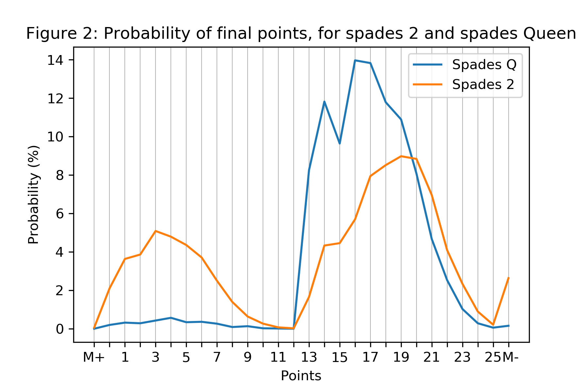
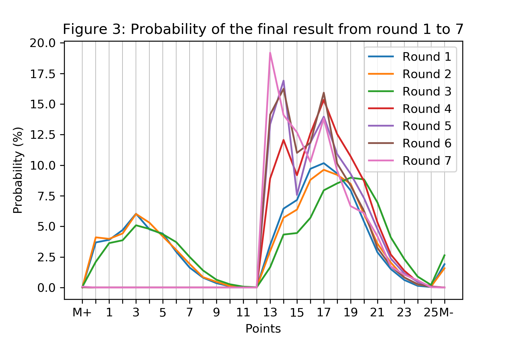
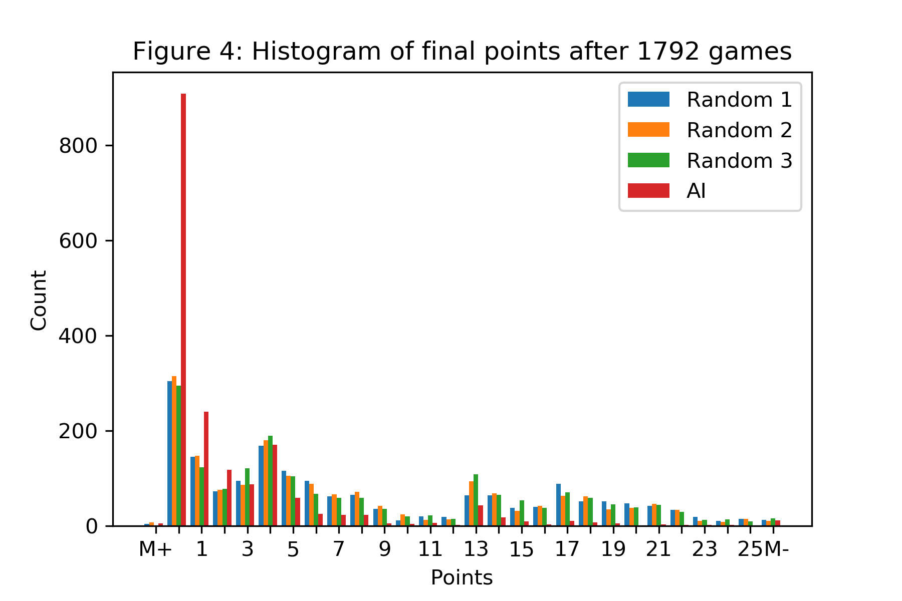

# Game Agent for Chess

# Introduction

Algorithms have been designed since decades to give computers superhuman capabilities to compete against humans in games.
The current state-of-the-art method have been developed by DeepMind, which is called AlphaZero.
AlphaZero is based on Monte Carlo tree search and supported with Deep Reinforced Learning.
The aim of this project is to implement for educational purpose a replica based on the published papers, and to get a deep understanding for future research.

# Monte Carlo Tree Search (MCTS)

## Traditional MCTS

Monte Carlo tree search is a heuristic search algorithm, which consists of 4 main iterative steps:

* Selection/Policy: start from the tree root and select successively the most promising child nodes until a leaf node is reached.
* Expansion: when a leaf node is reached, extend the leaf node with one (or more) child node.
* Rollout: from the expanded leaf node's child node, perform a random play until the result of the game is known (e.g. in game chess won/lost/draw)
* Backpropagation: write back the result of the random rollout to all visited child nodes during selection.

The MCTS algorithm allows to easily solve different problems with the same interface of a game.
The game needs to implement two functions to work with MCTS, "get next possible moves" and "compute win value".

## MCTS supported with Deep Reinforced Learning

Since traditional MCTS use random rollouts, the outcome of the decisions is strongly affected by randomness.
This is the reason why MCTS have been outperformed in most of cases by the MiniMax algorithm.
Furthermore, at the start of the problem, the search space is often so large that the decision is near to a random choice.
The mentioned issues have been improved by DeepMind with the use of Neural Networks.
Instead of making random rollouts, a neural network gives an approximation of the outcome of the decision at a give state.
One can think of this neural network as an intuition of a human expert.
Sometimes this network might give false approximations, MCTS can deal with such mistakes as it performs many iterative steps and consecutively updates approximations.

In March 2016, DeepMind's AlphaGo has beaten for the first time a 9-dan professional Go player.
AlphaGo is based on Monte Carlo tree search and deep learning.
It is tailored for the game Go, and has been trained both from human and computer play.
In December 2017, DeepMind introduced AlphaZero to master Chess, Shogi and Go with the same framework.
AlphaZero does not use any input training data, it trains itself solely via "self-play".
It proved to be stronger against AlphaGo by 100 to 0 wins.
It was compared to Stockfish, one of the strongest Chess AI, in a time-controlled 100-game tournament; 28 wins, 0 losses, and 72 draws for AlphaZero.

|  |
|:--:| 
| Cheat sheet of AlphaZero.
Downloaded on 27.10.2019 from: https://medium.com/applied-data-science/alphago-zero-explained-in-one-diagram-365f5abf67e0 |

## Implementation

MCTS have been implemented for both C++ and for Python.
The implementation of the training and inference framework only exists in Python and is implemented using Tensorflow.
The C++ MCTS communicates with the inference Python module using the ZMQ library.
The Python inference module implements execution on CPU, GPU (TensorRT) and Google Edge TPU.

Interfacing between problems (e.g. Chess or Connect4) and MCTS is solved with templates.
In general, a problem needs to implement two functions to work with MCTS, "get next possible moves" and "compute win/policy values".

### MCTS Parallelization for CPP

Tree parallelization is implemented in C++, where node expansion uses mutexes per nodes, backpropagation uses wait-free atomic operations.
Wait-free operations are not yet fully supported for floating-point operations, therefore these are implemented as lock-free operations with a helper class.
Multithreading is implemented with the help of OpenMP, which is supported by recent compilers (GCC: “-fopenmp”, MSVC: “/openmp”).
Leaf parallelization (i.e. parallel random rollouts) is implemented using CUDA and pure C only for Hearts (deprecated).

### Tree Container Implementations for CPP

For experiments, three tree representations have been implemented.
The interface between these containers and MCTS is based on templates.
The containers are:
* each node is allocated in arbitrary position on the heap, children are stored as pointers in a dynamic array,
* (deprecated) each node is allocated in one global dynamic array, children are stored as indices in a fixed length array (maximum number of children must be known),
* (deprecated) each node is allocated in one global dynamic array, children are stored as indices in a linked list.

After executing several performance benchmarks, no difference in speed could be seen.
In memory consumption the first and third method have shown similar values, the second method used more memory due to the fixed array for children.
Considering code readability and maintenance, the first method clearly outperforms the other methods.
During tests it turned out that the best implementation is, which can be easily implemented in parallel and maintained.
Tree parallelization is best suitable for the first method, since only leaf nodes have to be locked when children are added, no global lock needed.
Updating values of a node can be done with atomic operations and no mutexes are necessary.

## Experiments with MCTS and Deep Reinforced Learning

### Connect 4

Connect 4 is a game where a player must connect 4 stones either horizontal diagonal or vertical.
This game is an optimal challenge for a weak consumer-level PC to execute the AlphaZero framework.
For training a neural network, many self-play games are expected.

As of 2020 August, I have executed several learning iteration an studied how the DNN masters the game.
In order to quantitatively test the algorithm either best vs random/previous or best vs human games will be executed.

## Experiments with Traditional MCTS
### Chess

Chess is an NP-hard problem and has been investigated for many decades to evaluate AI algorithms.
It is a problem with complete information, therefore decisions are not influenced by unknown information.
For this reason it is a good idea to develop and test the traditional algorithm with chess.
The implementation allows to for a human play against the AI, which helps understanding and debugging the decisions.

The "get next possible moves" functions implements the game logic of chess, i.e. normal moves, castling, en passant, promotion and verifies if king is in check.
The "compute win value" function is based on the weighted number of player figures divided by the weighted number of figures on board, no board positions or etc is considered currently in win value.
During the tree exploration, the algorithm considers also the opponent's move as actions.
Experiments have shown that minimizing the win value during the decision of the opponent significantly improves the decisions.

After many plays against humans (regular human chess players), the pure MCTS based algorithm made several interesting moves and won a few games.
Lessons learned so far:

* Correct attack/defense decisions were most of the cases found if a move was in one or two depths.
* Correct decision were not found if the tree would need to be traversed in many depth.
After visualizing some decisions with 150000 iterations, is was visible that not more than six depths (3 actions for both players) were investigated.
* Many unnecessary movements due to the fact that "win" computation does not include any position information.
For example, king is moved in front of queen, blocking queen to attack forward from its starting position.
* At the beginning of the game, sometimes the algorithm sacrifices a knight or bishop for a pawn.
It seems that with the current win value computation, the algorithm fluctuates the node value.
Example: First investigated move is to take the protected pawn with the knight (now the win is +1).
Algorithm has to visit all the moves of opponent, only one move decreases the win. Note that during visiting all moves the value of the node will increase.
Now the algorithm will explore the opponents move, which takes the knight as long as it decreases the node value.

### Traveling Salesman Problem (TSP) (Deprecated)

The TSP is an NP-complete problem, which means it is computationally expensive to find the optimal solution, but easy to verify a solution.
It is also a benchmark for approximation algorithms, where a close to optimal solution is searched.
The MCTS is not exactly for such problems designed, but it is possible to apply it.
Basically the selection of graph nodes/edges can be modeled as a tree.

Two solutions have been implemented: a vertex based and an edge based.
The vertex based solution is designed as: which node should be next in the tour (i.e. node must be adjacent with the tour) ?
The edge based solutions is designed as: which edges should be taken next (i.e. edge not need to be incident with the tour) ?

The drawback of applying MCTS for TSP is that at the beginning the search space can be huge.
At the end of the algorithm, a second stage should be applied where decisions are fine-tuned (e.g. eliminate path crossings).

### Hearts (Deprecated)

Hearts is a a point-evasion card game.
It is a game with incomplete information (i.e. cards of other players are not known), therefore it is harder to understand and debug decisions.
I played with this game on Windows instead of Minesweeper or Solitaire :)
This game is currently less considered in the development, but this was the first implemented problem.

#### Solving Invalid States using Flow Network

The state of the game can get invalid, if the unknown cards cannot be distributed between the opponents.
As an example; player 1 knows his cards and has spades.
Now player 1 simulates the game, assumes player 2 and player 3 has no spades.
In the next step, the algorithm assumes player 4 has no spades.
In this case the game state would be invalid, since several spades cannot be distributed between the players.

This issue is modeled as an assignment problem, solved as a flow network using the Ford-Fulkerson algorithm.
The graph is composed as G_{4, 4} complete bipartite graph, with one half connected to a source and the other to a sink.
In G_{4, 4} one half of vertices represents color, the second represents players.
The edges of G_{4, 4} have the capacity of 52 (number of cards).
The complete flow that needs to flow from source to sink is the number of unknown cards.
The capacity of edges between the source and colors is computed by the number of unknown cards per color.
The capacity of edges between the players and the sink is computed by the number of not played cards per player.
After the graph is set, specific edges are removed or their capacity is decremented, depending on the state to verify.
A card can be played if the complete flow from source to sink can be sent.

#### Evaluation

A game was simulated, where 3 random players play against one AI with 10000 policy iterations and for each policy 1 rollout iteration.
Figure 1 visualizes the game tree of the AI player.
For easier interpretation, only the nodes with the selected cards for every player and the nodes where the AI has to decide between his cards are shown.

The game in Figure 1 shows the following play:

+ In the first round, the first player must play clubs 2, second player puts clubs Ace.
Now AI must decide between his clubs, puts King.
This is reasonable, because it is lower than Ace, therefore he does not take the cards.
Third player puts Queen. 
+ Second round: second player puts clubs 6.
Now AI must decide between his clubs, puts 3.
Reasonable for the same reason as before.
Third player puts 7, first player puts 10.
+ Third round: first player puts spades 5, second puts spade 6.
Now AI must decide between spades Queen and 2, puts 2.
Since spades Queen is 13 points, this is reasonable.
It can be seen from the edge colors that spades 2 was way more visited than spades Queen (around 10% to 90%).
In Figure 2 it can be seen that the probability of getting less than 13 points if spades Queen is played is extremely low.
Third player puts 8.
+ Fourth round: in this round third player starts with spades, therefore AI has no choice and must play spades Queen and gets 13 points.
+ Fifth round: now AI starts and puts diamond Ace.
This is reasonable and seen often in online games.
Since no diamond has been played, it is possible that all players still have diamonds.
Also spades Queen is already out.
+ Sixth round: again AI starts and puts clubs 8.
This could be argued if a good move is or would be better to play diamonds, but definitely not a move, which could not be reasoned.
+ Seventh round: second player starts with diamond 3.
AI must decide between 5 and 7.
Not much to argue here.
+ Eight round: AI starts and has to decide between clubs 9 or diamond 5.
Since there is no more clubs at other players, he puts diamond 5. 
+ Ninth round: third player puts spades Ace.
Since AI has no spades, can play any cards and puts hearts 10.
This is reasonable, because this is the highest hearts he has and he has the only clubs left in the game.
Note: in this case 10 and Jack have the same effect if they are played.
+ Tenth round: third player puts diamonds 10.
Again AI puts the highest hearts for the same reasons as before.
+ Eleventh round: second player puts hearts 2.
AI decides to put hearts 4, since hearts 5 was still not played.
+ Twelfth and Thirteenth round: No decision can be made.
First hearts 6, then clubs 9 must be played.
+ Note: swapping of three cards at the beginning is not implemented

In a win/lose type of game, the evaluation of nodes is done by the count of wins.
Since hearts is not a win/lose, but a point-evasion game, normalized probabilities for getting a number of points are computed, which can be seen in Figure 3.
These probability values are weighted and summed to get a value for node evaluation.
Note: M+ means AI Shot the Moon, M- means opponent Shot the Moon.

To test the strength of the AI, several games were executed and a histogram of received points was stored.
The executed games had 3 random players and one AI with 200000 policy and 1 rollout iteration.
Figure 4 visualizes the histogram and shows that the AI received 3 times more zero points.

# Links

* [AlphaGo](https://www.nature.com/articles/nature16961?not-changed)
* [AlphaZero](https://arxiv.org/pdf/1712.01815.pdf)
* [Monte Carlo tree search](https://en.wikipedia.org/wiki/Monte_Carlo_tree_search)

* [Chess](https://en.wikipedia.org/wiki/Chess)
* [Connect4](https://en.wikipedia.org/wiki/Connect_Four)

* [Traveling Salesman Problem (TSP)](https://en.wikipedia.org/wiki/Travelling_salesman_problem)
* [TSP Datasets](http://www.math.uwaterloo.ca/tsp/data/index.html)

* [Hearts](https://en.wikipedia.org/wiki/Hearts)
* [Browser based Hearts, implemented rules](https://cardgames.io/hearts/)
* [Ford-Fulkerson algorithm](https://en.wikipedia.org/wiki/Ford%E2%80%93Fulkerson_algorithm)
